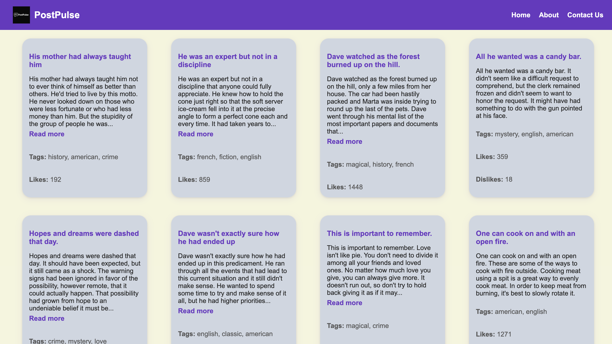
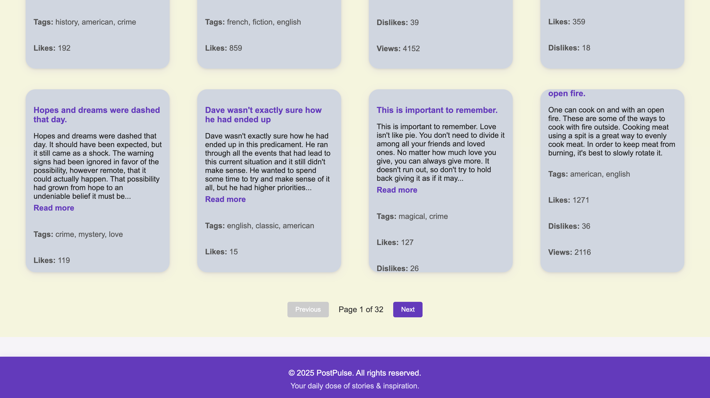

# PostPulse

PostPulse is a simple, modern web app for browsing and reading posts and stories. It is built with React and Vite, and uses a public API for demo content.

## Features

- Browse a wide variety of posts and stories
- See tags, likes, dislikes, and views for each post
- Responsive design: works on desktop, tablet, and mobile
- Click any card to view the full post details on a separate page
- "Read more" button to expand/collapse long post previews
- About page with project info
- Sticky footer that always stays at the bottom
- Clean, modern UI with a purple theme

## How to Use

1. **Home Page**: Shows a grid of post cards. Click any card to see full details.
2. **Read More**: If a post is long, click "Read more" to expand/collapse the preview.
3. **About Page**: Learn more about the project and its features.
4. **Pagination**: Navigate between pages of posts using Previous/Next buttons at the bottom.

## Screenshots

### Home Page


### About Page


### Card Grid Example


## Tech Stack
- React
- Vite
- Public API: [dummyjson.com/posts](https://dummyjson.com/docs/posts)

## How to Run
1. Install dependencies:
   ```bash
   npm install
   ```
2. Start the development server:
   ```bash
   npm run dev
   ```
3. Open [http://localhost:5173](http://localhost:5173) in your browser.

---


