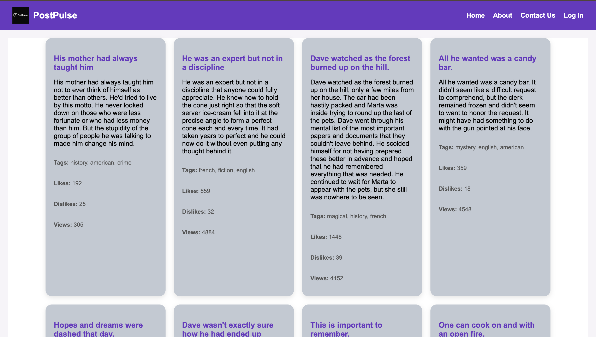

 PostPulse

PostPulse is a React-based frontend web application that displays blog-style posts using the DummyJSON API. The UI features a modern card layout, responsive design, and a custom-themed navbar.

 ->Features

-  Fetches real-time post data from DummyJSON API
-  Displays post content in beautifully styled cards
-  Tags and like counts shown for each post
-  Clean, modern UI with global CSS

->Tech Stack

- React.js (Functional components + Hooks)
- CSS (global styles)
-  Axios for API calls

 Screenshots

